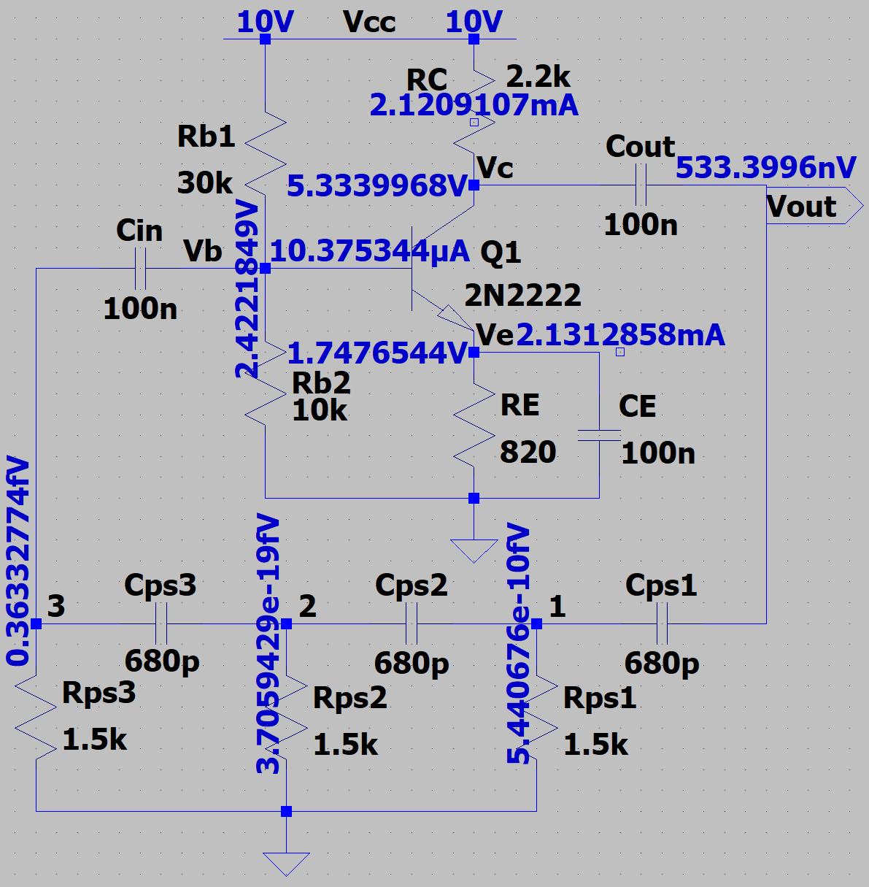
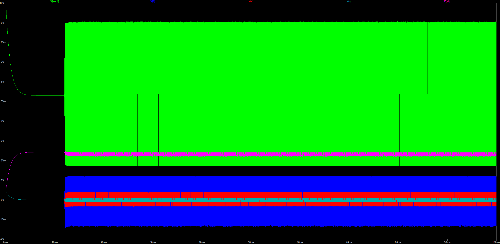
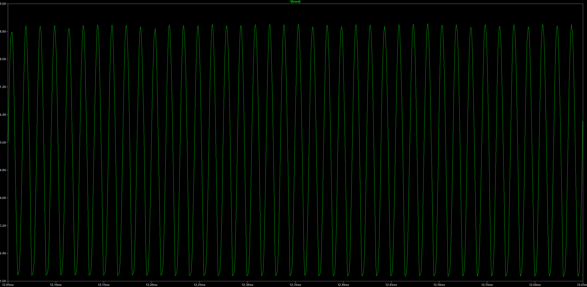
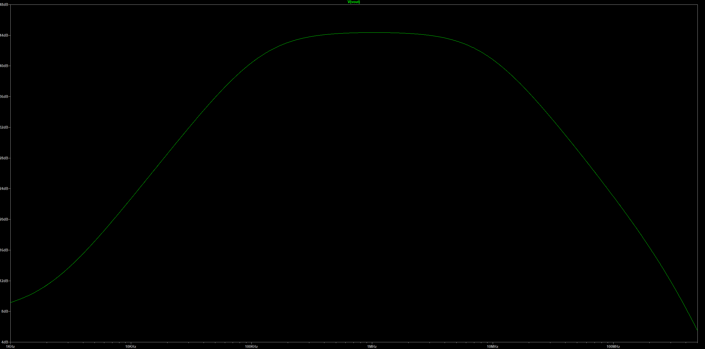
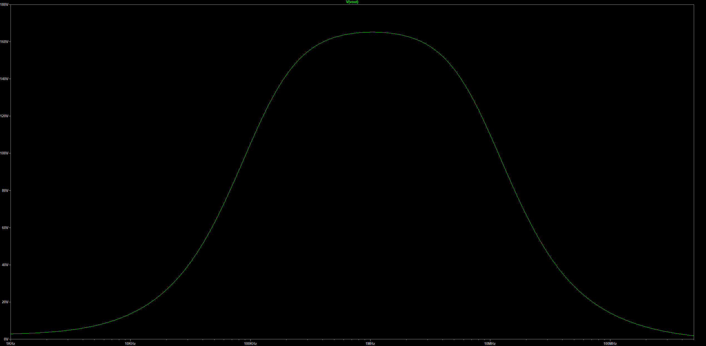

# Project 1 — RC Phase-Shift Oscillator

---

## Project Overview

This project designs, simulates, and analyzes a **BJT-based RC Phase-Shift Oscillator** that meets defined performance targets for oscillation frequency, power consumption, and output amplitude.  
The circuit uses a **common-emitter (CE) amplifier** combined with a **three-section RC feedback network** to generate a self-sustained sinusoidal waveform once started.

The CE amplifier provides an inherent **180° phase inversion**, while the RC ladder contributes an additional **180°** at the oscillation frequency \( f_0 \). Together, the system satisfies the **Barkhausen criteria**:

\[
|A\beta| = 1, \quad \angle(A\beta) = 0^\circ \, (\text{mod } 360^\circ)
\]

When both conditions are met, small noise at the input is amplified and fed back in phase, building up into a steady sinusoidal output.  
Once the oscillation amplitude grows, transistor nonlinearities reduce the gain slightly below unity, naturally stabilizing the waveform.

> **Schematic**  
> 

---

## Design Specifications

The circuit was evaluated according to the course rubric shown below, with primary goals for **high-frequency stability**, **low power consumption**, and **sufficient amplifier gain**.

| **Parameter** | **Specification Range** | **Target / Points Basis** |
|:--|:--:|:--|
| **Oscillation Frequency** | > 20 kHz → 40 pts<br>15–20 kHz → 30 pts<br>10–15 kHz → 20 pts<br>5–10 kHz → 10 pts<br>< 5 kHz → 5 pts | Aim for **> 40 kHz** (bonus region) |
| **Power Consumption** | < 90 mW → 20 pts<br> > 90 mW → 5 pts | Minimize bias current while maintaining gain |
| **Amplifier Gain (V/V)** | > 50 → 20 pts<br>40–50 → 15 pts<br>30–40 → 10 pts<br>< 30 → 5 pts | Achieve **> 50 V/V** (open-loop) |
| **Peak-to-Peak Amplitude** | > 5 V → 10 pts<br>4–5 V → 8 pts<br>3–4 V → 6 pts<br>< 3 V → 4 pts | Target **4–5 Vpp** steady-state output |

---

## Theory of Operation

### Principle

The oscillator employs **positive feedback** through an RC network to reinforce its own output at a single frequency.  
The **common-emitter amplifier** provides both voltage gain and phase inversion.  
The **three-section RC ladder** introduces frequency-dependent phase shift, producing exactly 180° lag at the oscillation frequency \( f_0 \).  
When combined with the CE amplifier’s 180° inversion, the total loop phase shift equals 360° (in phase), satisfying the Barkhausen phase criterion.

### Frequency and Gain Conditions

For three identical RC sections:
\[
f_0 = \frac{1}{2\pi R C \sqrt{6}}
\]
Plaintext: `f0 = 1 / (2π·R·C·√6)`

To sustain oscillation, the amplifier’s magnitude must exceed the feedback attenuation:
\[
|A| \ge 29
\]

The CE amplifier provides this gain, assisted by a bypass capacitor \( C_E \) across \( R_E \) that reduces AC feedback while maintaining DC stability.

As amplitude grows, transistor saturation and nonlinearity reduce effective transconductance \( g_m \), automatically limiting the oscillation amplitude — a self-stabilizing mechanism requiring no external limiter.

---

## Circuit Design

### Common-Emitter Amplifier (2N2222)

| **Component** | **Symbol** | **Value** | **Purpose** |
|:--|:--:|:--:|:--|
| Collector resistor | \( R_C \) | 2.2 kΩ | Defines collector swing and gain |
| Emitter resistor | \( R_E \) | 820 Ω | DC bias stabilization |
| Emitter bypass capacitor | \( C_E \) | 100 nF | Increases AC gain |
| Bias divider (top) | \( R_{B1} \) | 30 kΩ | Sets base bias voltage |
| Bias divider (bottom) | \( R_{B2} \) | 10 kΩ | Completes voltage divider |
| Coupling capacitors | \( C_{in}, C_{out} \) | 100 nF | AC coupling / DC isolation |
| Supply voltage | \( V_{CC} \) | 10 V | Power rail |

**Design Considerations**
- The DC operating point \( V_C \approx \frac{1}{2}V_{CC} \) allows maximum linear swing.
- \( C_E \) ensures sufficient small-signal gain near \( f_0 \) while keeping emitter feedback for bias stability.
- Bias currents chosen to limit total power < 90 mW.

---

### RC Feedback Network

| **Component** | **Symbol** | **Value** | **Function** |
|:--|:--:|:--:|:--|
| Resistors | \( R_{ps1}, R_{ps2}, R_{ps3} \) | 1.5 kΩ | Series resistors in phase-shift network |
| Capacitors | \( C_{ps1}, C_{ps2}, C_{ps3} \) | 680 pF | Shunt capacitors to ground providing lag |

**Frequency Estimate**
\[
f_0 = \frac{1}{2\pi \cdot (1.5\text{kΩ}) \cdot (680\text{pF}) \cdot \sqrt{6}} \approx 38\,\text{kHz}
\]
The theoretical result closely matches simulation.

---

## Simulation Results

### Transient — Startup and RC Node Voltages

Oscillation begins with low-level noise, amplified as loop gain \( |A\beta| > 1 \).  
Each RC section contributes ~60° phase shift, verified through the node voltages below.  
Amplitude builds until nonlinear transistor effects stabilize the oscillation.

> 

---

### Transient — Steady-State Output

After several cycles, the circuit achieves a clean, symmetric sinusoidal waveform.  
The frequency and amplitude remain steady once equilibrium is reached.

> 

---

### AC Analysis — Amplifier Open-Loop Gain (Magnitude in dB)

With the RC ladder disconnected, an AC sweep measures the amplifier’s intrinsic gain.  
The Bode magnitude (in dB) confirms a midband gain around **30 dB**, equivalent to ~31.6 V/V — sufficient to meet the Barkhausen gain condition when reconnected.

> 

---

### AC Analysis — Amplifier Open-Loop Gain (Magnitude in V/V)

The linear-scale gain plot highlights how the amplifier maintains a relatively flat midband response, ensuring oscillation startup over component tolerances.

> 

---

## Procedure

1. **Open** `circuit.asc` in LTspice.  
2. **Transient Simulation** (RC ladder connected):  
   ```spice
   .tran 0 100m startup

